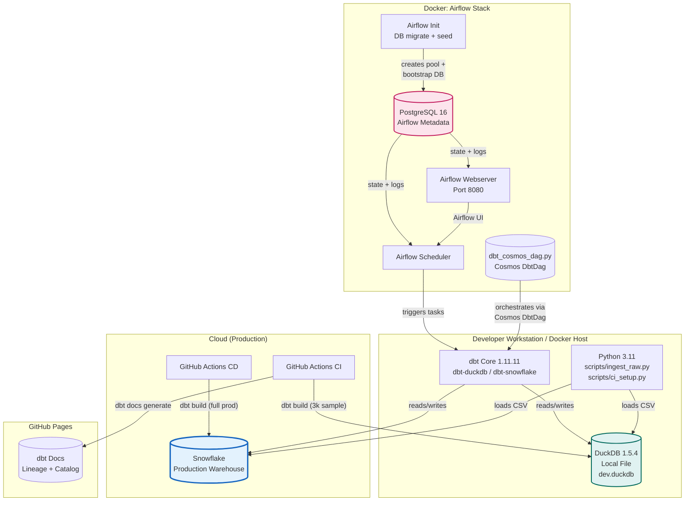
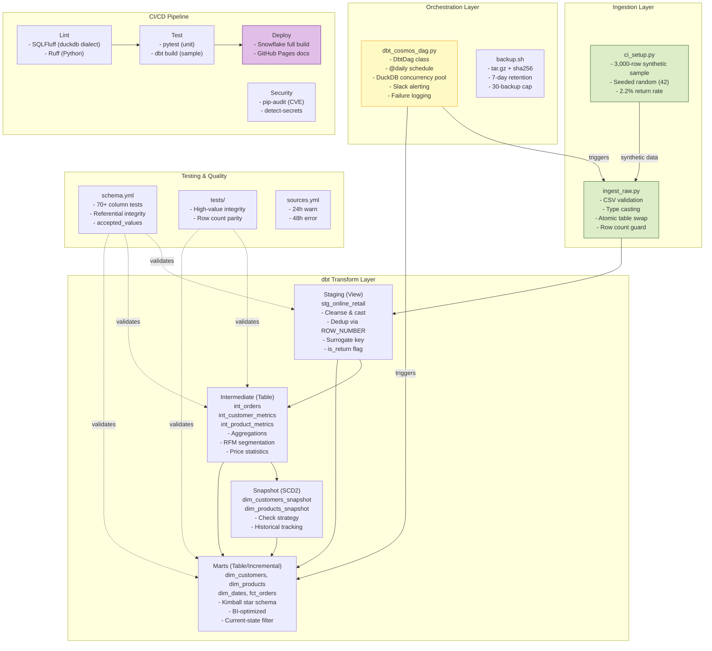
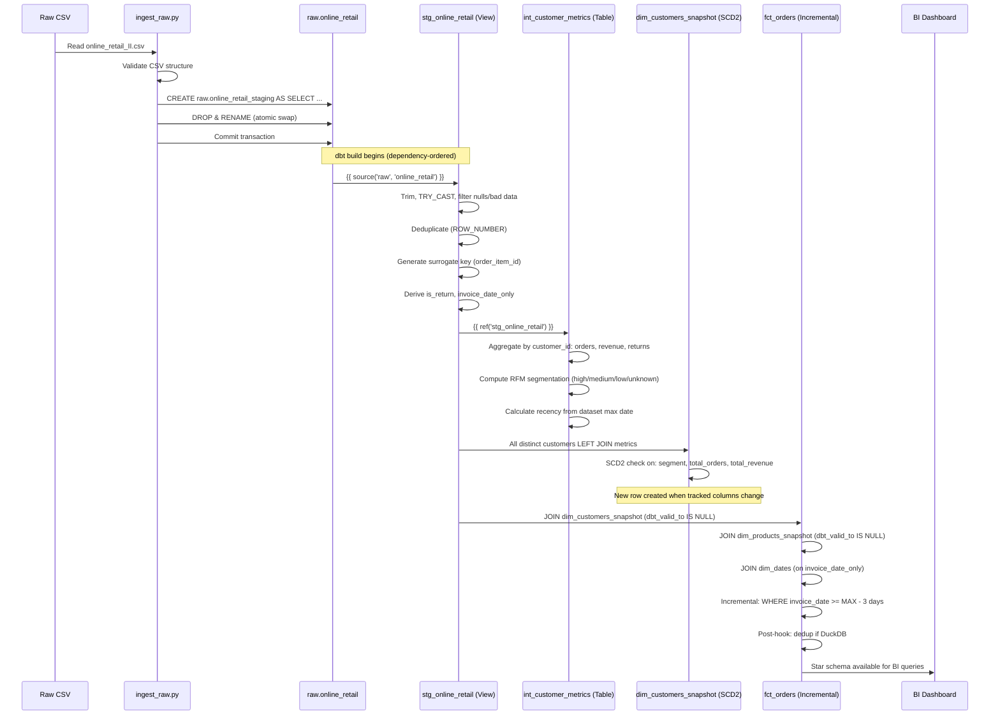
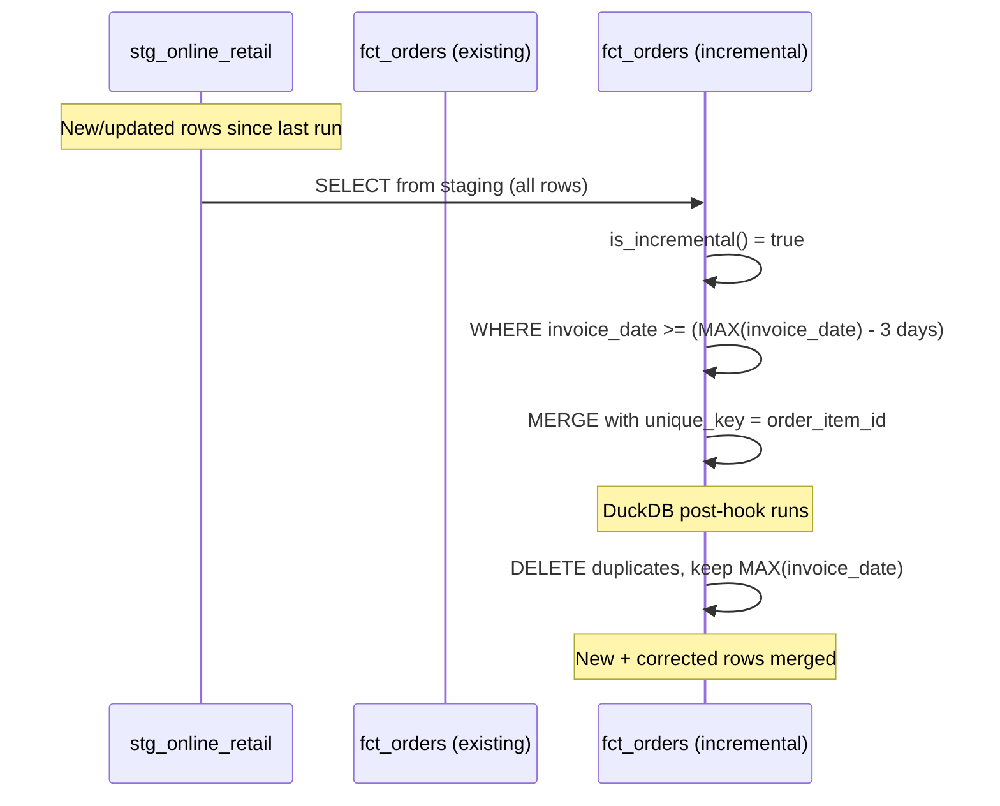

<!-- generated-by: gsd-doc-writer -->
# Architecture: Cloud-Native Analytics Engineering Pipeline

## System Context

The Cloud-Native Analytics Engineering Pipeline is a modern ELT (Extract-Load-Transform) system that ingests raw transactional CSV data, transforms it through a multi-layered dbt pipeline into a Kimball star schema, and serves analytics-ready data to BI tools. It is designed to run locally via DuckDB for development and at scale via Snowflake for production, orchestrated by Apache Airflow with Astronomer Cosmos.

```mermaid
graph TB
    subgraph "External Systems"
        CSV[("Online Retail II CSV\nKaggle Dataset\n~1M rows, 2009-2011")]
        BI[("BI / Analytics\nPower BI · Tableau · Metabase")]
    end

    subgraph "Cloud-Native Analytics Pipeline"
        INGEST["scripts/ingest_raw.py\nPython CSV Loader"]
        RAW[(("raw.online_retail\nDuckDB / Snowflake"))]
        DBT["dbt Core 1.11.11\nTransform Engine"]
        STG["stg_online_retail\nStaging (View)"]
        INT["int_customer_metrics\nint_product_metrics\nint_orders\nIntermediate (Table)"]
        SNAP["dim_customers_snapshot\ndim_products_snapshot\nSCD2 (Snapshot)"]
        MART["dim_customers, dim_products\ndim_dates, fct_orders\nMarts (Table/Incremental)"]
        ORCHESTRATOR["Apache Airflow 2.10.4\n+ Cosmos\nOrchestrator"]
    end

    subgraph "CI/CD"
        GHA["GitHub Actions\nCI/CD Pipeline"]
    end

    CSV --> INGEST
    INGEST --> RAW
    RAW --> STG
    STG --> INT
    INT --> SNAP
    INT --> MART
    SNAP --> MART
    STG --> MART
    MART --> BI

    ORCHESTRATOR -.-> INGEST
    ORCHESTRATOR -.-> DBT
    
    GHA -.->|"on PR: dbt build (3k sample)\non main: Snowflake prod deploy"| DBT

    style CSV fill:#f9f,stroke:#333,stroke-width:2px
    style RAW fill:#e1f5fe,stroke:#0277bd,stroke-width:2px
    style MART fill:#c8e6c9,stroke:#2e7d32,stroke-width:2px
    style ORCHESTRATOR fill:#fff3e0,stroke:#e65100,stroke-width:2px
    style GHA fill:#e8eaf6,stroke:#283593,stroke-width:2px
```

## Container Diagram

The system comprises four main containers: a Python ingestion script, dbt Core, an Airflow orchestrator, and the data warehouse (DuckDB or Snowflake).



## Component Diagram



## Data Flow Diagram

### Full ELT Data Flow



### Incremental Run Flow (Subsequent Runs)



## Technology Decisions and Rationale

### Core Stack

| Component | Choice | Rationale |
|-----------|--------|-----------|
| **Transform** | dbt Core 1.11.11 | Industry-standard analytics engineering tool. SQL-first, version-controlled, testable. |
| **Dev Warehouse** | DuckDB 1.5.4 | Embedded OLAP database. Zero-config, file-based, single-binary. Ideal for local development with no external dependencies. |
| **Prod Warehouse** | Snowflake | Cloud-native elastic warehouse. Separates compute from storage. Supports multi-cluster warehouses, zero-copy cloning, and time travel. |
| **Orchestration** | Apache Airflow 2.10.4 + Astronomer Cosmos | Mature orchestration platform. Cosmos provides first-class dbt integration (DbtDag class, task-per-model rendering). |
| **CI/CD** | GitHub Actions | Tight GitHub integration. Self-hosted runner support. Matrix builds for multi-platform testing. |
| **Dev Database** | PostgreSQL 16 (Airflow metadata) | Production-grade Airflow backend. Supports ACID, migrations, concurrent scheduler access. |

### Why DuckDB for Development?

- **Zero infrastructure**: No server to install, no service to start. A single file (`dev.duckdb`).
- **Speed**: Columnar execution engine processes 1M rows in milliseconds.
- **Compatibility**: SQL dialect closely mirrors Snowflake's. Most queries run identically.
- **Cost**: Free. No cloud credits consumed during development.

### Why Snowflake for Production?

- **Elasticity**: Multi-cluster warehouses scale horizontally for concurrent BI queries.
- **Separation of storage and compute**: Storage costs are independent of compute. Suspend warehouses when not in use.
- **Time Travel**: 90-day data recovery window.
- **Zero-copy cloning**: Instant database snapshots for dev/test without data duplication.

### Why Astronomer Cosmos?

- Native dbt integration via `DbtDag` — no shell operators or custom wrappers.
- Automatic task-per-model rendering: each model becomes an Airflow task with proper dependency ordering.
- `ExecutionConfig` for dbt binary path resolution between local and Docker environments.
- Support for `install_deps`, `pool` assignment, and `on_failure_callback`.

## Security Architecture

### Credential Management

```
┌──────────────────────────────────────────────────────────┐
│                    Credential Sources                      │
├──────────────────────────────────────────────────────────┤
│ Local Development                                          │
│ ├─ Environment variables (shell)                           │
│ ├─ airflow/.env (gitignored)                               │
│ └─ No hardcoded credentials in source code                 │
├──────────────────────────────────────────────────────────┤
│ CI/CD (GitHub Actions)                                     │
│ ├─ Repository secrets (SNOWFLAKE_*, encrypted at rest)     │
│ └─ OIDC token for GitHub Pages deployment                  │
├──────────────────────────────────────────────────────────┤
│ Production (Airflow Docker)                                │
│ ├─ airflow/.env file (Docker Compose env_file)             │
│ └─ SLACK_WEBHOOK_URL for failure alerts                    │
└──────────────────────────────────────────────────────────┘
```

### Security Controls by Layer

| Layer | Controls |
|-------|----------|
| **Application** | No hardcoded secrets. Secrets injected via environment variables. Fernet key used for Airflow connection encryption. |
| **Network** | Airflow webserver binds to `127.0.0.1:8080` only (not exposed to LAN). Docker internal network isolates Airflow services. |
| **CI/CD** | `detect-secrets` pre-commit hook + CI check. `pip-audit` CVE scanning. `.secrets.baseline` tracked in git. |
| **dbt** | Credentials via `env_var()` Jinja function. No connection strings in profile YAML. |
| **Data** | DuckDB file is gitignored. CSV data files are gitignored (`data/*.csv`). |

### Gitignore Security

Key entries from `.gitignore`:
```
.env
.env.*
airflow/.env
airflow/.env.*
*.duckdb
*.duckdb.wal
data/*.csv
```

## Deployment Architecture

### Local Development

```bash
# Single command full pipeline
python -m venv .venv && source .venv/bin/activate
pip install -r requirements-dev.txt
make build
```

### CI Pipeline (GitHub Actions — `.github/workflows/ci.yml`)

Triggered on: Pull requests to `main`, pushes to non-`main` branches.

```
┌─────────────┐    ┌─────────────┐    ┌─────────────┐    ┌─────────────┐    ┌─────────────┐
│  Checkout   │ -> │  Set up     │ -> │  Install    │ -> │  Security   │ -> │  Lint       │
│             │    │  Python 3.11│    │  deps       │    │  (pip-audit │    │  SQLFluff + │
│             │    │             │    │             │    │  + detect-  │    │  Ruff       │
│             │    │             │    │             │    │  secrets)   │    │             │
└─────────────┘    └─────────────┘    └─────────────┘    └─────────────┘    └─────────────┘
                                                                                    │
                                                                                    v
┌─────────────┐    ┌─────────────┐    ┌─────────────┐    ┌─────────────┐    ┌─────────────┐
│  Generate   │ <- │  pytest     │ <- │  Lint       │    │  Ingest     │ <- │  dbt deps   │
│  synthetic  │    │  tests/     │    │  (SQL+Python)│    │  sample     │    │  (cached)   │
│  sample     │    │             │    │             │    │  data       │    │             │
└─────────────┘    └─────────────┘    └─────────────┘    └─────────────┘    └─────────────┘
       │
       v
┌─────────────┐    ┌─────────────┐    ┌─────────────┐
│ dbt build   │ -> │  Source     │ -> │  (Optional) │
│ (ci.duckdb) │    │  freshness  │    │  Snowflake  │
│             │    │             │    │  CI test    │
└─────────────┘    └─────────────┘    └─────────────┘
```

Key CI details:
- Uses `ci.duckdb` database (separate from `dev.duckdb`).
- dbt packages cached using `actions/cache` with hash of `packages.yml`.
- Snowflake CI job runs only if `github.repository_owner == 'ak'` and `SNOWFLAKE_CI_ENABLED == 'true'`.
- Snowflake build uses `--select state:modified+ --defer` for incremental PR validation.

### CD Pipeline (GitHub Actions — `.github/workflows/cd.yml`)

Triggered on: Push to `main`.

```
┌─────────────┐    ┌─────────────┐    ┌─────────────┐    ┌─────────────┐
│  Checkout   │ -> │  Set up     │ -> │  Install    │ -> │  Validate   │
│             │    │  Python 3.11│    │  dbt-snowflake│    │  Snowflake  │
│             │    │             │    │             │    │  connection │
└─────────────┘    └─────────────┘    └─────────────┘    └─────────────┘
                                                                 │
                                                                 v
                                              ┌─────────────┐    ┌─────────────┐
                                              │  Done       │ <- │  dbt build  │
                                              │             │    │  (Snowflake │
                                              │             │    │  full prod) │
                                              └─────────────┘    └─────────────┘
```

### Docs Pipeline (GitHub Actions — `.github/workflows/docs.yml`)

Triggered on: Push to `main`.

Generates dbt documentation from synthetic data and deploys to GitHub Pages.

### Airflow Docker Deployment

```
┌────────────────────────────────────────────────────────────┐
│                      Docker Host                              │
│                                                              │
│  ┌──────────────────────────────────┐  ┌──────────────────┐  │
│  │  airflow-webserver               │  │  postgres:16     │  │
│  │  Port 127.0.0.1:8080             │  │  Port 5432       │  │
│  │  Airflow 2.10.4 + Cosmos         │  │  Airflow metadata│  │
│  └──────────────┬───────────────────┘  └──────────────────┘  │
│                 │                                             │
│  ┌──────────────▼───────────────────┐                         │
│  │  airflow-scheduler                │                         │
│  │  Reads dbt_cosmos_dag.py         │                         │
│  └──────────────────────────────────┘                         │
│                                                              │
│  Mounted volumes:                                            │
│  - ../dbt_project → /opt/airflow/dbt_project                  │
│  - ./dags → /opt/airflow/dags                                 │
│  - ./logs → /opt/airflow/logs                                 │
└──────────────────────────────────────────────────────────────┘
```

Airflow-specific details from `dbt_cosmos_dag.py`:
- `DbtDag` class with `@daily` schedule.
- `duckdb_pool` (size=1) prevents concurrent DuckDB writer contention.
- Retry: 2 retries, 5-minute delay, exponential backoff.
- On failure: JSON log to `/opt/airflow/logs/dag_failures.log` + optional Slack webhook alert.
- Dynamic path resolution between local dev and Docker.

## Monitoring and Alerting

### Availability Monitoring

| Component | Monitoring Method | Location |
|-----------|-------------------|----------|
| Airflow health | Docker healthcheck (port 8080) | `docker-compose.yaml` |
| Postgres health | pg_isready | `docker-compose.yaml` |
| CI pipeline status | GitHub Actions badges | `README.md` |

### Data Quality Monitoring

| Check | Mechanism | Threshold |
|-------|-----------|-----------|
| Source freshness | `dbt source freshness` | Warn: 24h, Error: 48h |
| Row count integrity | `assert_fct_orders_row_count_matches_staging.sql` | > 0.1% deviation |
| Business logic | `assert_no_high_value_customers_with_negative_revenue.sql` | Zero tolerance |
| Column-level quality | 70+ schema tests in `schema.yml` | Varies by column |

### Alerting

**Airflow DAG failure callback** (`dbt_cosmos_dag.py`):
1. Writes structured JSON to `/opt/airflow/logs/dag_failures.log`:
   ```json
   {"timestamp": "2026-07-03T12:00:00", "dag_id": "online_retail_elt",
    "task_id": "dbt_build", "error": "..."}
   ```
2. Sends Slack alert via webhook (if `SLACK_WEBHOOK_URL` is configured):
   ```
   :red_circle: DAG failure: online_retail_elt | Task: dbt_run | Error: ...
   ```

**CI/CD alerts**:
- CI failures surface as GitHub Checks on PRs.
- CD failures surface as GitHub Actions run failures on `main`.
- GitHub notifications configured per-repository.

### Backup Monitoring

The `backup.sh` script (invoked via `make backup`):
- Creates `tar.gz` archive with SHA-256 checksum.
- Maintains 7-day retention window.
- Hard cap of 30 backups.
- Logs success/failure to stdout.

## Airflow DAG Configuration

The `dbt_cosmos_dag.py` defines the production orchestration:

```python
dbt_dag = DbtDag(
    dag_id="online_retail_elt",
    schedule="@daily",
    start_date=datetime(2026, 6, 1),
    catchup=False,
    max_active_runs=1,
    default_args={
        "retries": 2,
        "retry_delay": timedelta(minutes=5),
        "retry_exponential_backoff": True,
        "on_failure_callback": dag_failure_callback,
    },
    profile_config=ProfileConfig(
        profile_name="duckdb",   # or "snowflake" via DBT_PROFILE env var
        target_name="dev",        # or "prod" via DBT_TARGET env var
        profiles_yml_filepath=profiles_yml_path,
    ),
    operator_args={
        "install_deps": True,
        "pool": "duckdb_pool",   # DuckDB single-writer concurrency pool
    },
    tags=["elt", "online_retail"],
)
```

- **DuckDB pool** (size=1): Prevents task starvation when multiple dbt tasks contend for DuckDB's single-writer lock. Created during `airflow-init`:
  ```bash
  airflow pools set duckdb_pool 1 "DuckDB single-writer concurrency pool"
  ```
- **Dynamic path resolution**: The DAG checks for `/opt/airflow/dbt_project` (Docker) and falls back to `../dbt_project` (local).

---

## Production Snowflake Configuration

Provisioned by `scripts/snowflake_bootstrap.sql` (one-time manual setup — see `docs/PRODUCTION_SETUP.md`):

| Setting | Value |
|---------|---------------|
| **Warehouse** | `ELT_WH`: X-Small, single-cluster, auto-suspend 5 min, auto-resume. Resource monitor (`ELT_MONTHLY_BUDGET`) alerts at 75%/90% and suspends at 100% of monthly credit quota. |
| **Roles** | `DBT_ROLE` (CI/CD build/write, scoped to `analytics`+`raw` schemas — not `GRANT ALL`), `READ_ONLY` (analyst SELECT-only on `analytics`) |
| **fct_orders clustering** | `cluster_by=['date_key', 'customer_key']` (active in `fct_orders.sql` config). Weekly backstop `RECLUSTER` via the `recluster_fct_orders` Snowflake TASK — Snowflake's automatic clustering handles most reclustering continuously; this task is defense-in-depth, suspended by default. |
| **dim_customers / dim_products clustering** | Not applied — dataset is ~1M rows, below the >5M-row threshold where clustering these dimensions pays for itself. Revisit under Phase 10 (CST-01) if scale grows. |
| **dim_dates** | No clustering needed (~730 rows) |
| **Warehouse/multi-cluster tuning** | Deferred to Phase 10 (CST-01) — Phase 7 ships safe cost-floor defaults only, not sizing optimization. |
