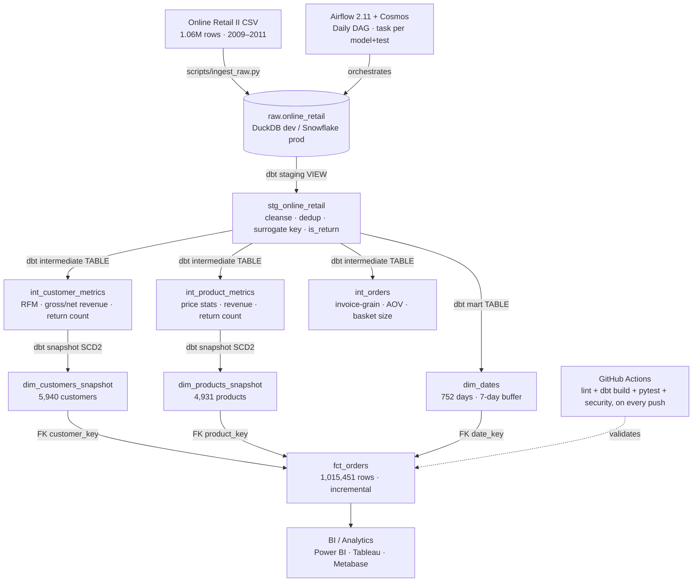

# Cloud-Native Analytics Engineering Pipeline

[](https://github.com/Ashok007-cmd/cloud-native-analytics-engineering-pipeline/actions/workflows/ci.yml)
[](https://www.getdbt.com/)
[](https://www.python.org/downloads/)
[](LICENSE)

A dual-target **ELT pipeline** built with dbt, DuckDB/Snowflake, and Airflow — turning 1.06M raw
e-commerce transactions into a tested, documented Kimball star schema. The same dbt project runs
unchanged against a local DuckDB file for development and against Snowflake for production.

Everything claimed below was independently verified by actually running the tools (`dbt build`,
`pytest`, `ruff`, `sqlfluff`, `pip-audit`) — not by reading this project's own prior reports, two
of which turned out to describe git/GitHub activity that had never happened (see Engineering Notes
below).

---

## Architecture



## Why this project

| Capability demonstrated | Where |
|---|---|
| Dual-target ELT (local dev, cloud prod) with zero SQL rewrite | `profiles.yml`, `dayofweek_expression` macro |
| Kimball dimensional modeling with SCD Type 2 history | `snapshots/`, `models/marts/` |
| Incremental models with late-arriving-data handling | `fct_orders.sql` (3-day lookback, `on_schema_change='fail'`) |
| Data quality as code — 150 automated dbt tests, not just row counts | `models/schema.yml`, `macros/test_*.sql` |
| CI on every push: lint, a full dbt build against a synthetic sample, pytest, and dependency/secret scanning | `.github/workflows/ci.yml` |
| Security practiced, not just documented: hash-pinned deps, SHA-pinned Actions, pre-commit secret scanning, non-destructive backups | `SECURITY.md`, `.pre-commit-config.yaml`, `scripts/backup.sh` / `restore.sh` |
| Orchestration with real failure handling | `airflow/dags/dbt_cosmos_dag.py` (retries, Slack alerts, graceful DAG-parse degradation) |

## Stack

| Component | Dev | Prod |
|-----------|-----|------|
| Warehouse | DuckDB (local file) | Snowflake |
| Transform | dbt 1.11.11 + dbt-duckdb | dbt 1.11.11 + dbt-snowflake |
| Orchestration | Airflow 2.11 + Astronomer Cosmos (Docker) | Airflow 2.11 + Cosmos |
| CI | GitHub Actions (`lint`, `build-and-test`, `security` jobs) | — |

## Quickstart

```bash
# 1. Clone and create a virtual environment
git clone https://github.com/Ashok007-cmd/cloud-native-analytics-engineering-pipeline.git
cd cloud-native-analytics-engineering-pipeline
python -m venv .venv && source .venv/bin/activate
pip install --require-hashes -r requirements-dev.txt

# 2. Ingest raw data (requires data/online_retail_II.csv from Kaggle — see Dataset below)
make ingest

# 3. Install dbt packages and build (run + test)
make build

# 4. Generate and serve dbt docs
make docs
# → opens http://localhost:8080 with full lineage graph
```

### Using the Makefile

```
make help          # list all targets
make install       # dbt deps
make ingest        # load CSV → raw.online_retail
make build          # install + ingest + dbt build
make test           # dbt test only
make test-py        # pytest (unit tests + coverage)
make lint           # SQLFluff + ruff
make security       # pip-audit + detect-secrets
make validate-all   # lint + test-all + security (full pre-merge check)
make docs           # dbt docs generate & serve
make backup         # gzip DuckDB + sha256 checksum (non-destructive)
make restore FILE=backups/<name>.tar.gz   # restore a DuckDB backup
make airflow-up     # docker compose up (Airflow)
make airflow-down   # docker compose down
make clean          # remove dbt artifacts + DuckDB files
```

## Airflow (Docker)

```bash
cd airflow
bash ../scripts/bootstrap_env.sh   # generates .env with a fresh Fernet key + two independent passwords
docker compose up -d
# UI: http://localhost:8080  (admin / <the generated AIRFLOW_ADMIN_PASSWORD>)
```

## dbt Layer Structure

| Layer | Materialization | Models | Purpose |
|-------|----------------|--------|---------|
| `models/staging/` | View | `stg_online_retail` | Cleanse, cast, rename, dedup, `is_return` flag |
| `models/intermediate/` | Table | `int_customer_metrics`, `int_product_metrics`, `int_orders` | Reusable RFM, revenue, and order-grain metrics |
| `models/marts/` | Table / Incremental | `dim_dates`, `fct_orders` | Kimball star schema for BI |
| `snapshots/` | SCD Type 2 | `dim_customers_snapshot`, `dim_products_snapshot` | Slowly changing dimensions (check strategy) |

## Data Quality

- **150 automated dbt tests** across staging/intermediate/marts/snapshots: `unique`, `not_null`, `accepted_values`, `relationships`, `positive_value`, `not_in_future`. A full `dbt build` runs 163 nodes total (150 tests + 6 table models + 1 view + 2 snapshots + 3 BI exposures as no-ops). Verified result: **159 pass, 1 intentional warn, 0 errors** — the one warn is a calendar-spine coverage check that will always flag non-sale days (weekends/holidays), documented inline in `models/schema.yml`, not a bug.
- **Custom macros**: `test_positive_value`, `test_not_in_future`, `calculate_gross_revenue`, `dayofweek_expression`
- **Source freshness**: warns after 24h, errors after 48h (measures ingest-job recency — this is a static historical dataset, so this isn't a proxy for "is the business data current")
- **CI enforces all of the above on every push** — see `.github/workflows/ci.yml`

## Scripts

| Script | Purpose |
|--------|---------|
| `scripts/ingest_raw.py` | Load CSV → DuckDB `raw.online_retail` (parameterised via env vars) |
| `scripts/ci_setup.py` | Generate a 3,000-row synthetic sample so CI doesn't need the 95MB source CSV |
| `scripts/backup.sh` | Compress + sha256-checksum a DuckDB backup (non-destructive), rotate after 7 days / 30 backups |
| `scripts/restore.sh` | Restore a DuckDB backup produced by `backup.sh`, with a safety copy of anything it overwrites |
| `scripts/bootstrap_env.sh` | Generate `airflow/.env` with a fresh Fernet key and two independent random passwords, `chmod 600` |
| `scripts/snowflake_bootstrap.sql` | One-time production Snowflake setup: least-privilege roles, warehouse, budget alerting, clustering task |

## Dataset

[Online Retail II UCI](https://www.kaggle.com/datasets/mashlyn/online-retail-ii-uci) — 1.06M non-store online retail transactions from a UK retailer, 2009–2011.

> The raw CSV is not committed to this repo (95MB). Download from Kaggle and place at `data/online_retail_II.csv` before running `make ingest`. CI doesn't need this file — it builds `scripts/ci_setup.py`'s synthetic sample instead.

## Security

- Credentials are injected via environment variables — never hardcoded
- `airflow/.env` and `airflow/airflow.cfg` (auto-generated, contain a live encryption key) are `.gitignore`d and must never be committed
- The Airflow webserver binds to `127.0.0.1` only (localhost); the admin UI password has no default fallback — `docker compose up` fails hard if it isn't set
- `make security` (`pip-audit` + `detect-secrets`) runs locally via pre-commit and in CI on every push
- Dev/CI Python dependencies (`requirements-dev.txt`, `dbt_project/requirements-snowflake.txt`) are clean per `pip-audit`. The Airflow dependency set (`airflow/requirements.txt`) has 20 known CVEs remaining in `apache-airflow` 2.11.2 and a few of its providers (down from 33 on 2.10.5) — the rest require an Airflow 3.x major-version migration (breaking DAG-authoring changes), tracked as a deliberate, scoped follow-up rather than a silent bump
- GitHub Actions in `.github/workflows/ci.yml` are pinned to commit SHAs (not floating version tags), fetched live from the GitHub API when added

## Engineering Notes

This project went through several rounds of self-review during development. A few of the resulting report files (`AUDIT_REPORT.md`, `CLEANUP_REPORT.md`, `FINAL_SECURITY_AND_IMPROVEMENT_REPORT.md`, `IMPROVEMENT_PLAN.md`) fabricated or referenced a git/GitHub Actions/Pages history that never existed at the time, and have since been removed — this repository's actual git history starts with its real first commit. The remaining files (`ANALYSIS_REPORT.md`, `RESEARCH_REPORT.md`, `REVIEW.md`) still contain useful in-repo technical findings (SCD2 join logic, incremental dedup behavior) that were spot-checked and look genuine, but treat any operational claim in them (CI runs, deployments) with skepticism unless independently verified against the actual code and this repo's real commit history.

## License

[MIT](LICENSE) © 2026 Ashok Kumar V
